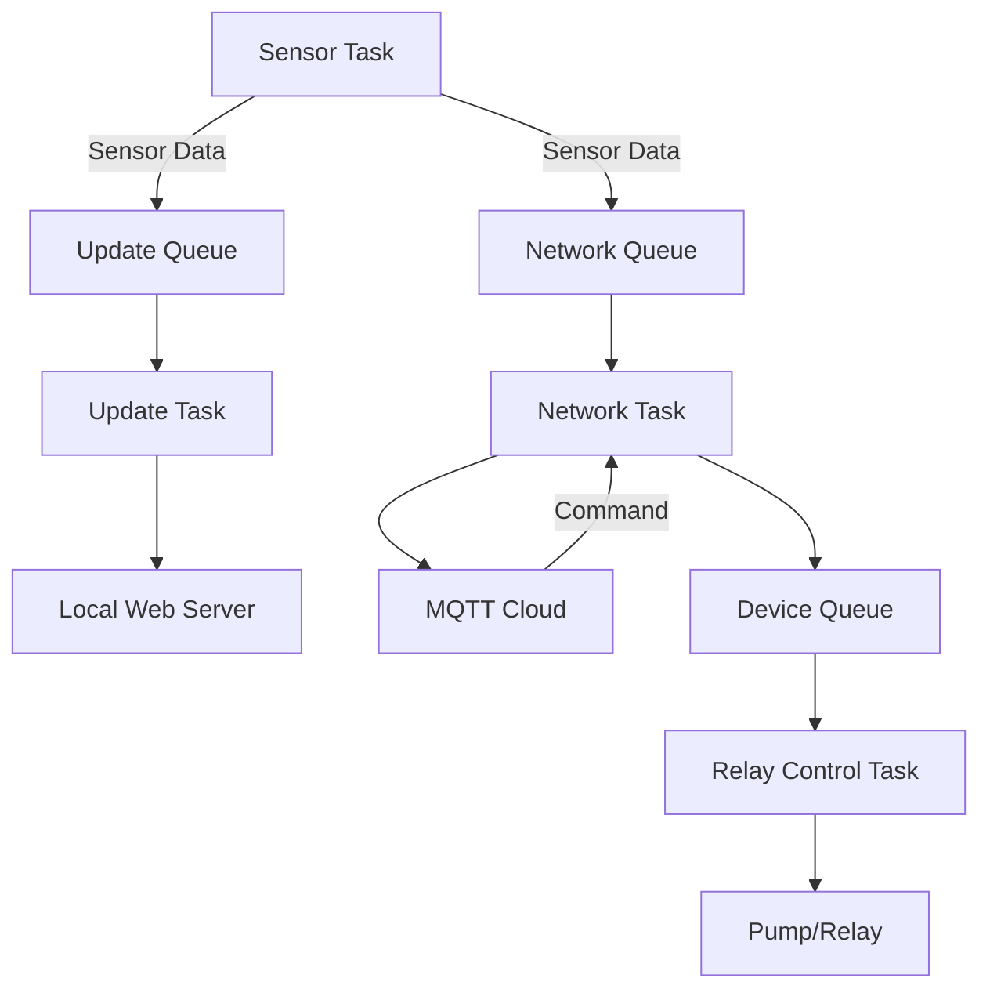

# Main Application Controller (app_main.c)

This is the **central orchestrator** of the Smart Garden system running on ESP32. It initializes the entire system, creates and manages all FreeRTOS tasks, and coordinates data flow between sensors, control logic, UI, and cloud communication.

## System Architecture

The system uses a **multi-task FreeRTOS architecture** with tasks running on both cores and communicating via queues and semaphores.



## FreeRTOS Tasks

| Task                     | Priority | Core | Stack   | Description                                                                 |
|--------------------------|----------|------|---------|-----------------------------------------------------------------------------|
| `sensor_telemetry_task`  | 5        | 1    | 4096    | Periodically reads DHT11 & soil moisture → sends data to UI and MQTT queues |
| `relay_control_task`     | 6        | 1    | 4096    | Executes Auto/Manual pump logic, processes commands from `device_queue`    |
| `ui_update_task`         | 5        | 0    | 3072    | Updates global HTTP packet for local Web Dashboard                         |
| `network_task`           | 10       | 0    | 4096    | Manages WiFi, starts STAmode services, handles MQTT publish/subscribe     |

## Inter-Task Communication (Queues)

| Queue             | Type               | Purpose                                              | Producer                  | Consumer                |
|-------------------|--------------------|------------------------------------------------------|---------------------------|-------------------------|
| `network_queue`   | `sensor_data_t`    | Telemetry data → Cloud (MQTT)                        | Sensor Task               | Network Task            |
| `device_queue`    | `device_control_t` | Control commands (Relay ON/OFF, Mode switch)         | Web API / MQTT RPC        | Relay Control Task      |
| `ui_queue`        | `sensor_data_t`    | Real-time sensor data → Local Web UI                 | Sensor Task               | UI Update Task          |

## Hardware Pin Mapping

```c
#define DHT11_PIN       GPIO_NUM_18   // Temperature & Humidity
#define SOIL_PIN        GPIO_NUM_1    // Soil Moisture (ADC)
#define RELAY_PIN       GPIO_NUM_10   // Pump / Relay control
#define LED_PIN         GPIO_NUM_48   // Status LED
```

## MQTT Broker Configuration

```c
#define MQTT_BROKER_HOST "your-cluster-url.s1.eu.hivemq.cloud"
#define MQTT_BROKER_PORT 8883
#define ACCESS_TOKEN     "your-mqtt-token-or-username"
```

> Uses secure **mqtts://** (TLS) connection. Certificate bundle is attached automatically.

## WiFi & Operating Modes

- **Provisioning**: Handled by `APmode` component — automatically switches to SoftAP if saved WiFi is unreachable
- **mDNS**: Enabled → access dashboard via **http://smartgarden.local**

## Auto Mode Control Logic

In `relay_control_task`, the pump turns **ON** only when **all enabled conditions** are met (AND logic):

```
(Temperature condition OR disabled) &&
(Humidity condition    OR disabled) &&
(Soil moisture condition OR disabled)
```

Disabled sensors are ignored in the decision.

## Safety & Resilience Features

- **Task Watchdog protection** – all tasks use non-blocking delays
- **Queue overflow handling** – old messages are dropped to accept new critical ones
- **Network resilience** – automatic WiFi reconnect + restart of Web/MQTT services on connection loss
- **No boot loops** – thanks to APmode’s verify-before-save mechanism

The system is designed for **24/7 reliable operation** in garden/greenhouse environments.

Enjoy your fully autonomous Smart Garden!